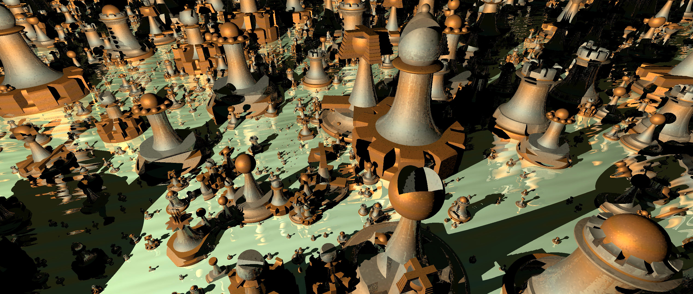

Welcome to the source code for **Wisconsin Chess**!

Chess can be described as a fun tactical board game played by two people against each other. It enables both competition and perhaps evokes metaphors of war, debate, or many kinds of stories, and it's a good brain exercise and peaceful way to socialize. Chess was played and incrementally designed by generations of people through centuries and is often seen in art, and many people will play chess today around the world.

This source code is for a multiplayer computer game variation of chess, Wisconsin Chess. The game adds to the traditional modern rules of chess while keeping the abstract theme and important predictability of the original game. Pieces start on the same squares, castling, en passant, promotion, check, checkmate, and draws are included, and there is no randomness, stats, or hidden information.

If you want to learn chess or improve your skill then this game will help you do that.

</img>

What's added is the trading card game idea (but without trading for now). Players each have a collection of pieces with new characteristics that can optionally replace the regular chess pieces, so emergent scenarios from a choice of many strategies keep gameplay fresh and exciting no matter how long you've played.

</img>

The new pieces are all based on the original chess pieces and may have zero, one, or two characteristics that affect their interactions with other pieces. Possible moves are sometimes varied to balance the power of pieces.

</img>

</img>

Because of the possible complexity of new piece interactions the computer determines which moves can be made each turn, then the player simply picks one. It is not possible to cheat or make an illegal move without direct access to the host.

Wisconsin Chess is hosted in your local network using a personal computer or [BeagleBone Black](https://beagleboard.org/black) single-board computer, then people play by connecting to it with a web browser through the network. For players the latest versions of Edge, Chrome, Firefox, and Safari are supported and no browser plugins or other installation is necessary.

This local network website is designed to work well both on mobile smartphones and tablets alongside personal computers, and any number of concurrent players can be playing through the host up to the limits of that computer's capabilities.

Wisconsin Chess is intended to be best played multiplayer around a table, during a LAN party, in an office, or in a computer lab, where the players interact in person. With some creativity a tournament should be straightforward to implement by using this software to play matches.

</img>

Technical installation instructions that use this source code repository are described in docs/install.md. An overview of the source code is in docs/source.md.

## Project Status

Wisconsin Chess is a work in progress. It was inspired by one of the ideas I researched after quitting my tech job to pursue entrepreneurship in spring 2014. Coding for this iteration of the project began partway through 2017 and a first version was completed during the start of 2018 (see the v0.1 git tag), but it was shelved then.

During 2020 I've had the opportunity to work on it again. Version 0.2 is a massive improvement and is currently in an alpha state as I continue to make it more unbreakable. This current version of Wisconsin Chess is best played on devices larger than smartphones because zooming isn't supported yet and eye strain is a problem.

For now new features aren't being added while I collect feedback about this early version. If you play Wisconsin Chess and find a mistake or think something should be better then any report is appreciated. Please [open a discussion](https://github.com/pciet/wichess/discussions) on GitHub for your feedback.

If you would like to freely contribute a small amount of money to support Wisconsin Chess then buying my music at [matthewjuran.bandcamp.com](https://matthewjuran.bandcamp.com) is the best way to do that.

## Copyright, Licenses, Credits

This source code is the work from just me, but its foundation is the free and open software projects of many other people, and I started with knowledge gained from university studies and industry experience. Like people have done for me, I hope the quality of this source code could make it a resource to help you or others make their ideas.

A copyright notice for Wisconsin Chess is in the COPYRIGHT file.

Content with copyright owned by others is included in this repository under license, described here:

The web/fonts folder has the unmodified Linux Biolinum font, which has the copyright notice and license in licenses/SIL Open Font License.txt.

The Gorilla WebSocket package is in vendor/github.com/gorilla/websocket.

A subset of the golang.org/x/crypto package is in vendor/golang.org/x/crypto.

The knight piece was copied from a set of chess piece design files. Credit, copyright notice, and the license are in img/knight.inc.
